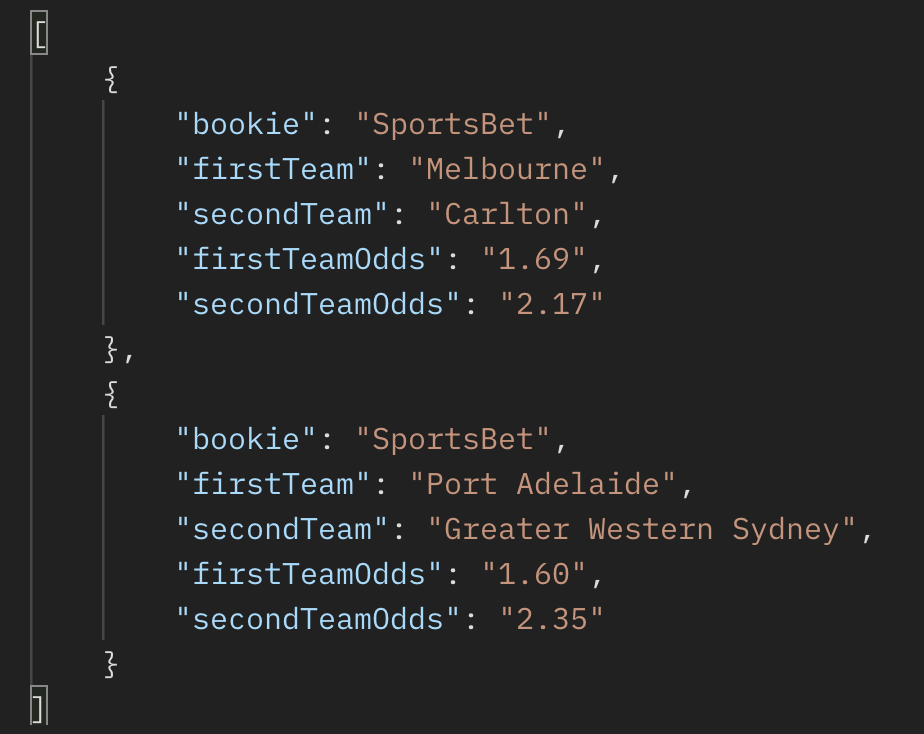

# Arb Check - Odds Scraper

This Odds Scraper is an API built with Node.js, Express.js and Puppeteer. It scrapes odds data and which teams are playing. Made to be used in tandem with the [Arb Check Console](https://github.com/lukereed1/arb-check-console) app and the [Arb Calculator](https://github.com/lukereed1/arb-calculator).

(Still adding sports)

## Features

- Utilises the Puppeteer stealth plugin for undetectable scraping
- Endpoints for:
  - EPL (English Premier League)
  - MLB (Major League Baseball)
  - NRL (Rugby League)
  - AFL (Aussie Rules)

## Quick Start

### 1. Clone the repository:

```bash
git clone https://github.com/lukereed1/arb-check-backend
```

### 2. Navigate to the project directory:

```bash
cd arb-check-backend
```

### 3. Install Dependencies:

```bash
npm install
```

### 4. Start API Server

```bash
npm start
```

### 5. Access API

```
GET http://localhost:5000/<bookie-here>/<sport-here>
```

## Bookies

- sportsbet
- neds
- tab
- pointsbet
- unibet
- boombet
- betdeluxe
- topsport
- palmerbet

## Sports

- rugby-league
- afl
- mlb
- soccer/epl

Note epl has soccer before it in URL. Soccer is only sport with plans to add more leagues.

## Example Inputs

Neds Rugby League data

```bash
http://localhost:5000/neds/nrl
```

Sportsbet AFL data

```bash
http://localhost:5000/sportsbet/afl
```

## Example Output



## Future Plans

- Add more Sports
- Add line odds
- Add player props odds
